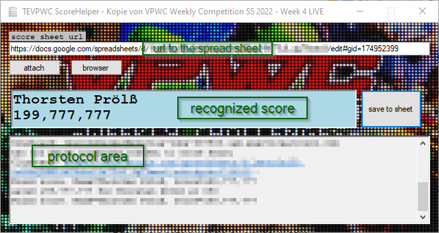

# VPScoreHelper
# Purpose
This is a small tool which may ease to fill in a google spread sheet containing pinball scores and rankings. The scores are collected in the facebook group "The Elite Virtual Pinball Weekly Challenge" and filled into a google spreadsheet of specific format.
# How it looks like

# Installation
* The program depends on the .NET Framework 4.7.2. On current windows distributions this is usually already installed.
* There is no real installation needed. Just put all the files of a release into a new folder. For example in C:\VPScoreHelper\
* For accessing the google api there must be a credential file *VPScoreHelper.json* copied into the program folder. As it contains sensitive information it's not included in this repository. If you want to run this program, ask the author for the credentials, or get a free google developer account and create an own service account with credentials.
# Usage
* Run the program by starting *VPScoreHelper.exe*
* On first start the app is not connected to a google sheet. Copy the url of the sheet into the textbox "score sheet url" and press the attach button. The url looks something like *https://docs.google.com/spreadsheets/d/SpreadSheetId/edit#gid=11111111*
    * If the *write access* to the sheet is denied, the owner of the sheet must grant *write access* to the service account "vpscorehelper@precise-tube-337908.iam.gserviceaccount.com"
    * When the connection succeeds, the app writes into the protocol some informations like the title of the sheet and how many entries were found. The window title shows the name of the spread sheet.
    * It would be nice to show the image of the current table in the app but unfortunately the google sheets api v4 does not provide a possibility of accessing the embedded image.
* On further starts, the app auto-connects the sheet from the last session.
* You may press the *browser* button which opens the spread sheet in a browser window to verify you're on the correct sheet or even to watch the scores appear in real time. Although this is not necessary. The scores can be entered without the browser window.
* With the program running, take any text containing a member name and a score into the clipboard by pressing *CTRL-C* or with right-click and context menu *copy*. The app will recognize and show the found member name and score with a button *save to sheet*. Pressing the button will write the score into the ADMIN section of the sheet. If everything is ok, the score in the app will show a *(SAVED)* text.
* You can at any time press *attach* button what does a reload of the google sheet.
# Preview
[Live preview](https://drive.google.com/file/d/1QMFxJWWvCB58oyvna2nUG4AEHyBQQb8v/view?usp=sharing)
# Some tech details
## What third party libs are used?
* [Google APIs, in special the Google sheets API v4 and Authentication](https://developers.google.com/sheets/api)
* [Newtonsoft.Json](https://www.newtonsoft.com/json)
* [SharpClipboard](https://github.com/Willy-Kimura/SharpClipboard)
## To whom does the app talk to?
It makes online access to 
* The google authentication service
* The selected spread sheet via the google sheet v4 API
## What does it store on local PC?
* Some settings like last sheet url are stored in the .NET default appdata folder of the application. This can usually been found in C:\Users\ *username* \AppData\Local\VPScoreHelper\
* Logs are stored into a subfolder *log* of where the *VPScoreHelper.exe* is located 
## How does the app work?
* On startup or whenever a sheet is attached, the app connects to the score sheet using the credentials of a service account
* Accessing a sheet with google sheet API needs some sort of authentication, which all have some drawbacks. 
    1. API key: can be generated for the app. But only allows read access to sheets - no writing of scores.
    1. Login with users account: the user of the app can login with his own personal account. But this gives the app more privileges than needed. For example, the app could access files in the users google drive. And there also appears a nasty google warning about trust of the app.
    1. Service account: there can be established a google *service account* related to the app where specific rights can be granted. It works similar to a user account. This is the way I have choosen for this app. The drawback is that there must be credentials provided in form of a JSON-file. The service account is related to the authors google account.
* Once attached, the app reads all entries from the ADMIN page of the sheet to get all valid member names.
* From now on, the app observes the windows clipboard for appearance of a member name. This is kind of tricky as member names in facebook does not always match the names in the sheet 1:1 especially when it comes to characters missing in the english alphabet like é or ø. But the app does its very best to find a match.
* When a member name is found, the app tries to get a valid score value from the clipboard entry. The score can have different kinds of thousand delimiter characters or no delimiter at all.
* When a valid *member name / score* entry is found, this is shown in the ui and the opportunity of saving to the sheet is given.
* When the *save* button is pressed, the app will store the score value into the specific score cell of the Admin page. The line number is known from the inital loading of the sheet. To prevent some sort of error, before storing, the member name in the concerned line is read again und validated against the clipboard name. It could happen that someone else modified the admin page in the meantime. In this case, the score is not stored, an error appears and the sheet has to be attached again - per *attach* button or re-starting the app.

